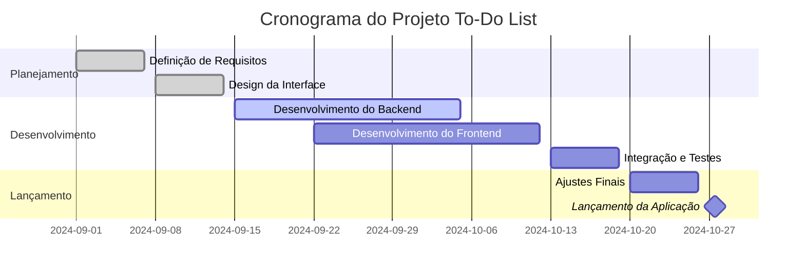
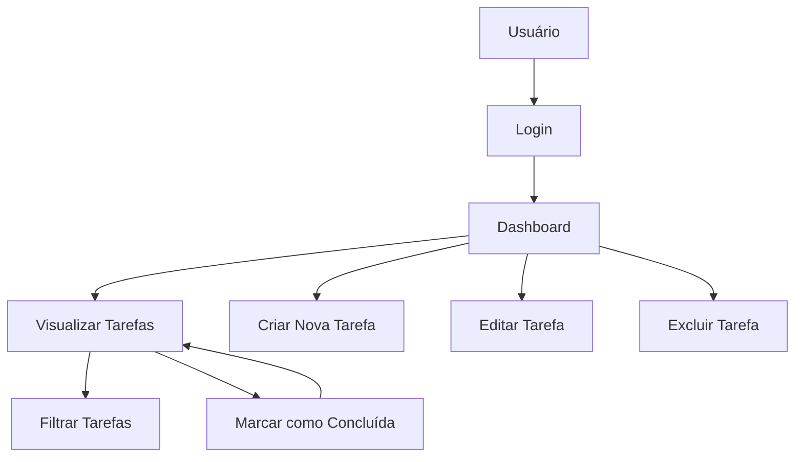
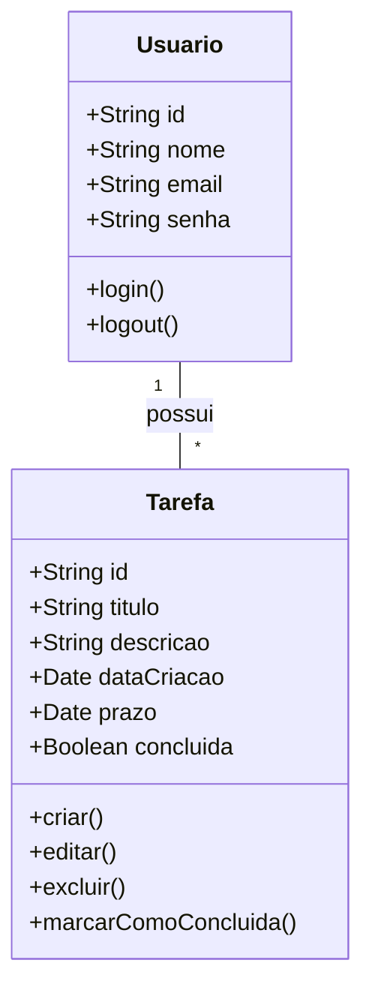

# Escopo do Projeto: Aplicação To-Do List

## O que Vamos Fazer

Desenvolver uma aplicação web para gerenciamento de tarefas (To-Do List). A aplicação permitirá que os usuários criem, editem, removam e marquem tarefas como concluídas. Além disso, a aplicação deve ser responsiva, garantindo uma experiência de usuário consistente em dispositivos móveis e desktops.

## Escopo Funcional

### O que o sistema deve fazer:
- **Criar Tarefas**: Permitir que os usuários criem novas tarefas com título, descrição e prazo.
- **Editar Tarefas**: Permitir que os usuários editem as informações das tarefas existentes.
- **Excluir Tarefas**: Permitir que os usuários removam tarefas indesejadas.
- **Marcar como Concluída**: Permitir que os usuários marquem tarefas como concluídas ou pendentes.
- **Filtragem e Pesquisa**: Possibilitar a filtragem e pesquisa de tarefas com base em critérios como status e data de criação.
- **Autenticação de Usuários**: Implementar um sistema de login e registro para que cada usuário tenha sua própria lista de tarefas.

## Escopo Não Funcional

### Como o sistema deve desempenhar as funções:
- **Performance**: A aplicação deve carregar em menos de 2 segundos para qualquer ação do usuário.
- **Segurança**: Implementar criptografia para as credenciais dos usuários e proteger as listas de tarefas com autenticação.
- **Usabilidade**: Interface intuitiva com design simples e direto para fácil navegação e uso.
- **Responsividade**: A aplicação deve ser totalmente responsiva, funcionando bem em dispositivos móveis, tablets e desktops.
- **Escalabilidade**: Arquitetura preparada para suportar até 10.000 usuários simultâneos.
- **Manutenibilidade**: Código modular e bem documentado para facilitar futuras melhorias e manutenção.

## Objetivos SMART

S: Específico
Desenvolver uma aplicação To-Do List simples, que permita a criação, edição, exclusão e marcação de tarefas como concluídas. A aplicação também terá uma interface básica e será responsiva para funcionar em diferentes dispositivos.

M: Mensurável
Completar o desenvolvimento do projeto com um mínimo de 5 tarefas criadas e gerenciadas com sucesso durante a fase de testes. Documentar o processo de desenvolvimento e principais aprendizados, visando aplicar os conceitos em futuros projetos.

A: Atingível
Utilizar tecnologias e frameworks já conhecidos, como HTML, CSS, JavaScript e [Nome do Framework/Tech Stack], garantindo que o projeto seja uma oportunidade de consolidar habilidades existentes e explorar novas técnicas.

R: Relevante
Este projeto servirá como um estudo de caso para fortalecer o entendimento de desenvolvimento front-end e back-end, contribuindo para o aprimoramento das habilidades em programação e design de software.

T: Temporal
Concluir o desenvolvimento da aplicação dentro de 2 meses, com marcos semanais que incluem a finalização do layout da interface, implementação das funcionalidades principais e realização de testes.

## Cronograma

### Diagrama de Gantt

- **Mês 1**: Planejamento e design da aplicação.
- **Mês 2**: Desenvolvimento das funcionalidades principais (CRUD de tarefas).
- **Mês 3**: Implementação de autenticação e testes.
- **Mês 4**: Testes finais, ajustes e lançamento.

### Diagrama de Fluxo

### 2. Diagrama de Classe

### 3. Diagrama de Caso de Uso

```mermaid
flowchart TD
    Usuario[Usuário] --> CriarTarefa(Criar Tarefa)
    Usuario --> EditarTarefa(Editar Tarefa)
    Usuario --> ExcluirTarefa(Excluir Tarefa)
    Usuario --> MarcarConcluida(Marcar Tarefa como Concluída)
    Usuario --> VisualizarTarefas(Visualizar Tarefas)
    Usuario --> FiltrarTarefas(Filtrar Tarefas)

    CriarTarefa --> PreencherDetalhes(Preencher Detalhes da Tarefa)
    EditarTarefa --> ModificarDetalhes(Modificar Detalhes da Tarefa)
    ExcluirTarefa --> ConfirmarExclusao(Confirmar Exclusão)
    MarcarConcluida --> AtualizarStatus(Atualizar Status da Tarefa)
    FiltrarTarefas --> SelecionarCriterios(Selecionar Critérios de Filtragem)

    %% Descrições dos Casos de Uso
    CriarTarefa ---|Detalhes| CriarTarefaDetails["Permite ao usuário adicionar uma nova tarefa."]
    EditarTarefa ---|Detalhes| EditarTarefaDetails["Permite ao usuário modificar uma tarefa existente."]
    ExcluirTarefa ---|Detalhes| ExcluirTarefaDetails["Permite ao usuário remover uma tarefa."]
    MarcarConcluida ---|Detalhes| MarcarConcluidaDetails["Permite ao usuário marcar uma tarefa como concluída."]
    VisualizarTarefas ---|Detalhes| VisualizarTarefasDetails["Permite ao usuário ver todas as tarefas."]
    FiltrarTarefas ---|Detalhes| FiltrarTarefasDetails["Permite ao usuário aplicar filtros para visualizar tarefas específicas."]

```

## Análise de Risco

- **Risco 1**: Atraso no desenvolvimento devido a mudanças de requisitos - Mitigação: Definição clara dos requisitos desde o início e comunicação constante com stakeholders.
- **Risco 2**: Problemas de desempenho em dispositivos móveis - Mitigação: Testes de usabilidade contínuos em diferentes dispositivos durante o desenvolvimento.
- **Risco 3**: Brechas de segurança na autenticação - Mitigação: Uso de boas práticas de segurança e testes de penetração.

## Recursos

- **Equipe**: Desenvolvedores, Designer UX/UI, Gerente de Projeto.
- **Ferramentas**: [Nome das Ferramentas - ex: Visual Studio Code, GitHub, etc.].
- **Orçamento**: Recursos alocados para servidores, licenças de software e testes de usuário.

## Resultado Esperado

Ao final do projeto, espera-se entregar uma aplicação To-Do List funcional e intuitiva, com todas as funcionalidades descritas no escopo funcional, oferecendo uma experiência de usuário satisfatória e segura. A aplicação deve estar pronta para ser lançada ao público dentro do prazo estabelecido e atender às expectativas dos usuários em termos de desempenho e usabilidade.
